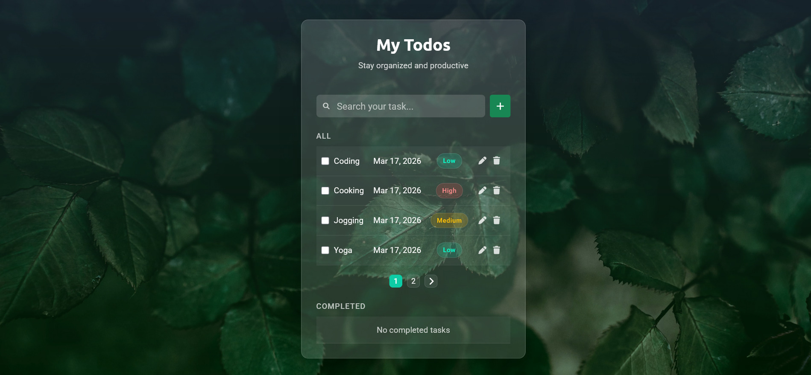
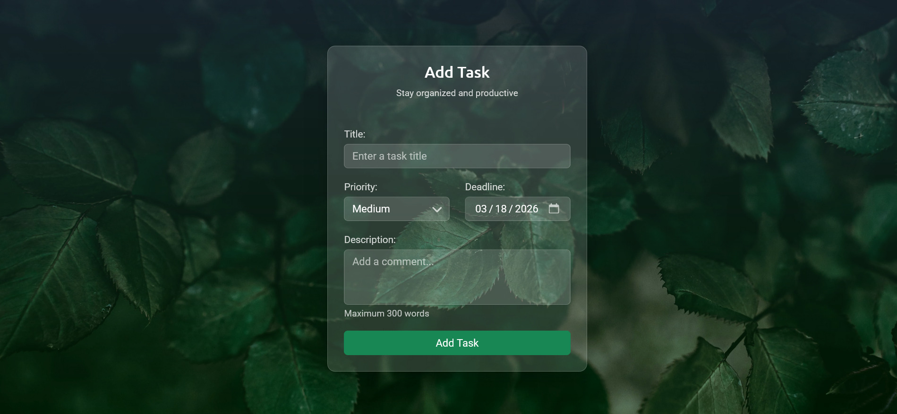
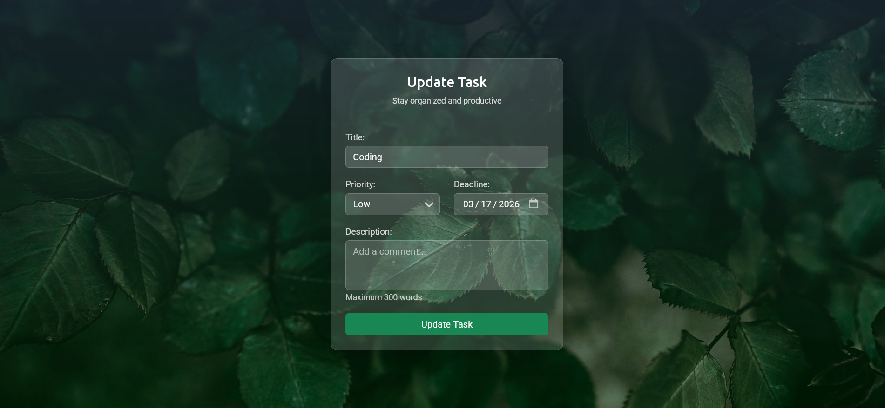

# StudyHub


   


## Overview
**Todo App** is a modern task management application built with **Django**, designed to help users efficiently organize, track, and manage their daily activities through an intuitive and visually appealing interface.

This project was built to practice full-stack Django development, **REST API design**, and production deployment.


### Features
- CRUD Functionality
- Pagination System
- Task Filtering & Search
- RESTful API Development
- Modern UI/UX Design


### Tech Stack
| Feature | Technology | Version |
|--------|------------|----------|
| Backend | Python, Django, Django Rest Framework | 3.13.6, 5.2.5, 3.16.1 |
| Frontend | HTML, CSS, Bootstrap, Javascript | - |
| Database | Sqlite3 | - |
| Tools | Git, Github, Render | - |


### Demo & Repository
**Live Demo** : [todo live](https://todo-esmn.onrender.com/)    

**Source Code** : [Github Repository](https://github.com/athikapriya/django-todo) 


### Preview
#### Homepage



#### Create Task



#### Update Task




### Installation
#### Clone the repository :
```bash
git clone https://github.com/athikapriya/django-todo.git
cd django-todo
```

#### Create virtual environment :
```bash
python -m venv venv
```

#### Activate environment
##### Windows
```bash
venv\Scripts\activate
```

##### macOs/Linux
```bash
source venv/bin/activate
```

#### Install dependencies
```bash
pip install -r requirements.txt
```

#### Run migrations
```bash
python manage.py migrate
```

#### Run development server
```bash
python manage.py runserver
```


### API Endpoints
Todo provides RESTful API endpoints built with Django REST Framework.
| Endpoint | Method | Description |
|----------|--------|-------------|
| `/api/tasks/` | GET | Returns a list of all tasks |
| `/api/tasks/<int:pk>/` | GET | Returns detailed information about a specific task by ID |
| `/api/tasks/completed/` | GET | Returns a list of all completed tasks |

### Contribution
Contributions are welcome! Please open an issue or submit a pull request.

### Author
**Athika Chowdhury Priya** - Python & Django Developer

Github : [athikapriya](https://github.com/athikapriya)

Portfolio : [athikapriya.netlify.app](https://athikadev.netlify.app/)

Email : [athikapriya1997@gmail.com](mailto:athikapriya1997@gmail.com) 